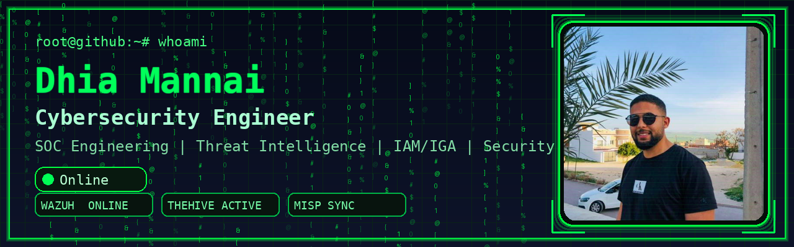

<p align="center"></p>

<div align="center">

# ┌──(dhia㉿github)-[~]
# └─$ whoami

```bash
Dhia Mannai

Cybersecurity Engineering Student @ ESPRIT

SOC Engineering | Security Automation | IAM & IGA | Threat Intelligence
```


</div>

---

# 🖥️ System Information

```bash
root@github:~# cat profile.txt

Name      : Dhia Mannai
Location  : Tunis, Tunisia
Role      : Cybersecurity Engineering Student
Focus     : SOC Engineering, Security Automation,
            IAM/IGA, Threat Intelligence

Status    : Building Security Solutions
```

---

# 🔒 About Me

```bash
root@github:~# cat about_me.txt
```

Cybersecurity engineering student with hands-on experience in SOC operations, security automation, threat intelligence, IAM/IGA, Active Directory, and infrastructure hardening.

Experienced in building real-world security platforms, deploying SIEM and SOAR solutions, automating threat intelligence pipelines, implementing identity governance processes, and securing enterprise infrastructure.

Passionate about detection engineering, blue team operations, threat hunting, and developing scalable security architectures.

---

# 🚀 Current Mission

```bash
root@github:~# current_focus
```

- Detection Engineering
- Security Automation
- SOC Architecture
- Threat Intelligence Integration
- IAM & IGA Solutions
- Active Directory Security
- DevSecOps

---

# 🛡️ SOC Status

```bash
[✓] Wazuh SIEM ................ ONLINE
[✓] TheHive ................... ONLINE
[✓] Cortex .................... ONLINE
[✓] MISP ...................... SYNCHRONIZED
[✓] Active Directory .......... OPERATIONAL
[✓] Security Automation ....... RUNNING
[✓] Threat Intelligence ....... ACTIVE
```

---

# 🌳 Skill Tree

```text
Security
├── Wazuh
├── TheHive
├── Cortex
├── Shuffle
├── MISP
├── Sigma Rules
├── Fail2ban
└── nftables

Infrastructure
├── Active Directory
├── Kerberos
├── LDAP
├── Ubuntu Server
├── Windows Server
└── Raspberry Pi

Programming
├── Python
├── Bash
├── PowerShell
├── Java
├── PHP
├── SQL
└── JavaScript

Networking
├── TCP/IP
├── VLAN
├── NAT
├── DNS
├── DHCP
├── SSH
└── VPN

DevSecOps
├── Docker
├── Jenkins
├── SonarQube
├── Git
├── Prometheus
└── Grafana

Identity & Access Management
├── Keycloak
├── Active Directory
├── LDAP
├── MidPoint
└── Identity Governance
```

---

# 📂 Featured Projects

```bash
root@github:~# ls projects/
```

### 🔹 SOC-SIEM-Platform
Wazuh-based SOC platform with monitoring, detection, dashboards, and incident management.

### 🔹 Threat-Intel-Pipeline
Automated IOC enrichment using MISP, ThreatFox, URLHaus, and security orchestration workflows.

### 🔹 IAM-IGA Platform
Identity and Access Management solution using Keycloak, MidPoint, LDAP, and Active Directory.

### 🔹 Secure LAN Infrastructure
Enterprise infrastructure deployment with Active Directory, Kerberos, SSH hardening, and network segmentation.

### 🔹 Raspberry Pi Firewall Gateway
Raspberry Pi-based firewall gateway using nftables, Fail2ban, Webmin, and security monitoring.

### 🔹 DevSecOps Pipeline
CI/CD pipeline integrating Jenkins, SonarQube, Docker, Prometheus, and Grafana.

---

# 🏆 Certifications

```bash
root@github:~# certs --list
```

- Cisco CyberOps Associate
- Cisco Network Security
- Additional Security Certifications In Progress

---

# 📊 GitHub Statistics

<p align="center">


</p>

---

# 🔥 Contribution Streak

<p align="center">

</p>

---

# 🎯 Cyber Challenge

```bash
root@github:~# cat encrypted.txt
```

```text
Q3liZXJzZWN1cml0eSBpcyBhIG1pbmRzZXQu
```

Hint: Base64

---

# 🚩 Hidden Flag

```text
666c61677b736f635f656e67696e6565725f6d696e647365747d
```

Hint: Hex → ASCII

---

# ⚡ Fun Fact

```bash
echo "446f6e2774206a757374206c6561726e2073656375726974792c206275696c642069742e"
```

Hint: Hex Decode

---

```bash
root@github:~# logout

Session terminated.

Stay curious. Stay secure.
```
